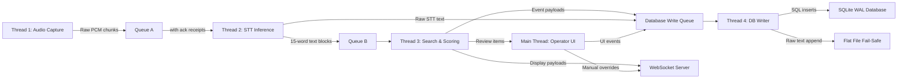

# System Architecture

This document defines the system-wide architecture of RhemaCast: the threading model, queue topology, data flow, and the four operational phases that govern a live service from boot to archive.

---

## Hardware Constraints

All architectural decisions are bound by a single, non-negotiable constraint:

| Resource | Budget |
|----------|--------|
| **GPU VRAM** | 4 GB total, dedicated exclusively to the primary STT model |
| **Standard RAM** | 16 GB minimum — hosts FAISS index, BM25 index, embedding model (ONNX), intent classifier, LRU caches, and all queues |
| **CPU** | Modern multi-core — drives the semantic embedding model, BM25 search, intent classification, and Vosk failover if GPU fails |

The architecture strictly partitions GPU and CPU workloads to prevent VRAM contention. See [gpu_and_hardware.md](gpu_and_hardware.md) for the full VRAM budget breakdown.

---

## Cross-Platform Development Strategy

> [!IMPORTANT]
> **RhemaCast is developed on Linux but targets Windows as its primary deployment platform.** The development/testing workflow uses VFIO GPU passthrough to eliminate cross-compilation entirely.

| Dimension | Details |
|-----------|----------|
| **Development OS** | Linux (developer's primary workstation) |
| **Primary target** | Windows `.exe` |
| **Secondary target** | Linux `.deb` |
| **Windows testing** | KVM/QEMU VM with NVIDIA GPU dynamically passed through via VFIO |
| **Windows packaging** | PyInstaller with a `.spec` file, built natively inside the Windows VM |
| **Linux packaging** | Standard `dpkg` / `.deb` built natively on Linux |

### The VFIO GPU Passthrough Workflow

The developer's NVIDIA GTX 1650 sits in a clean IOMMU group. A **libvirt hook script** automates the GPU handoff:

1. **VM start:** The hook unbinds the GPU from the Linux `nvidia` driver, attaches it to `vfio-pci`, and launches the Windows VM.
2. **Inside the VM:** Windows has bare-metal GPU access (zero virtualization overhead for CUDA). Faster-Whisper benchmarks match real Windows hardware exactly.
3. **VM shutdown:** The hook re-attaches the GPU to the Linux `nvidia` driver. No reboot required.

This workflow aligns with the architecture's GPU isolation mandate — VFIO makes it physically impossible for Linux and the Windows VM to contend for the GPU simultaneously.

### Windows Packaging: PyInstaller

The Windows `.exe` is built natively inside the Windows VM using PyInstaller with a `.spec` file:

- The `.spec` file explicitly includes `intent_triggers.json`, Faster-Whisper dependencies, and hidden imports (`pynvml`, `sounddevice`).
- **CUDA DLLs are NOT bundled** inside the `.exe`. The target Windows system must have the NVIDIA CUDA Toolkit installed separately. This keeps the binary lean and prevents DLL version conflicts between the bundled CUDA and the installed driver.
- `collect_data_files('faster_whisper')` ensures CTranslate2 model assets are included.

> [!CAUTION]
> **DLL Hell Prevention:** Never bundle `cublas` and `cudnn` DLLs inside the `.exe`. If the bundled CUDA version differs from the driver's expected version, inference will silently fail or crash. Assume the CUDA Toolkit is installed on the target system.

### Auto-Update

On startup, the application pings a public version manifest URL (e.g., a GitHub release JSON). If a newer version is available, a notification is shown with a **Download** button that opens the release page in the default browser.

---

## Threading Model

RhemaCast operates on a multi-threaded, queue-decoupled architecture. No thread directly calls another thread's functions. All inter-thread communication flows through thread-safe FIFO queues.

| Thread | Runs On | Responsibility |
|--------|---------|----------------|
| **Main Thread** | CPU | UI rendering, operator controls, lifecycle management |
| **Thread 1 — Audio Capture** | CPU | Captures 16kHz/mono/float32 audio via `sounddevice`, pushes raw PCM to Queue A |
| **Thread 2 — STT Inference** | GPU | Pulls audio from Queue A, runs Faster-Whisper inference, appends text to the sliding window buffer, pushes 15-word blocks to Queue B |
| **Thread 3 — Search & Scoring** | CPU | Pulls text from Queue B, runs BM25 + FAISS in parallel, fuses scores via RRF, evaluates intent, routes display decision |
| **Thread 4 — Database Writer** | CPU | Pulls event payloads from the Database Write Queue, executes sequential SQL inserts into the SQLite WAL database, writes the append-only flat file |
| **Thread 5 — Hardware Monitor** | CPU | Polls GPU die temperature via `pynvml`, issues power limit commands when thermal thresholds are exceeded |
| **WebSocket Server** | CPU | Lightweight server (started during Phase 1) that pushes display payloads to the HTML/CSS/JS renderer consumed by OBS Browser Source |

> [!NOTE]
> Thread 2 is the only thread that touches the GPU. Every other thread runs exclusively on CPU and standard RAM. This is a deliberate architectural constraint to protect the 4 GB VRAM budget.

### WebSocket Server

In addition to the thread-based architecture, a lightweight WebSocket server runs alongside the main threads to push display payloads to the HTML/CSS/JS renderer (consumed by OBS Browser Source).

> [!NOTE]
> **Health endpoint.** An HTTP GET server on port `8766` returns `{"status": "ok", "queue_depths": {...}}` for remote monitoring (e.g., Prometheus or a dashboard).

> [!IMPORTANT]
> **Security.** The WebSocket server binds exclusively to `127.0.0.1` and rejects all remote connections. All HTML payloads are sanitized; scripture text is HTML-escaped before rendering to prevent XSS.

---

## Queue Topology

### Queue A — Audio Pipeline
- **Producer:** Thread 1 (Audio Capture)
- **Consumer:** Thread 2 (STT Inference)
- **Payload:** Raw 16kHz mono float32 PCM audio chunks
- **Special behavior:** Implements an **acknowledgment receipt protocol**. Chunks remain in a "pending" state until Thread 2 confirms successful transcription by pushing text to Queue B. If the GPU crashes, unacknowledged chunks are replayed to the Vosk failover model. See [threading_and_lifecycle.md](threading_and_lifecycle.md) for details.

### Queue B — Text Pipeline
- **Producer:** Thread 2 (STT Inference), via the 15-word sliding window
- **Consumer:** Thread 3 (Search & Scoring)
- **Payload:** Complete JSON-like dictionary: `{'session_id', 'sequence_id', 'timestamp_ms', 'text_chunk'}`. Thread 3 uses this exact sequence ID when committing search results.

### Database Write Queue
- **Producers:** Thread 2 (raw STT text), Thread 3 (search metrics, display events), Main Thread (UI events)
- **Consumer:** Thread 4 (DB Writer)
- **Payload:** Independent event payloads with monotonic sequence IDs and session UUIDs
- **Guarantee:** Single-writer serialization eliminates all SQLite locking conflicts

> [!NOTE]
> **UI to Display Race Condition:** When the operator clicks "Show" on a queued verse, the WebSocket Push is fired asynchronously (`asyncio.create_task`) for instant display, while the database log is pushed to the unconstrained DB Write Queue. The WebSocket execution never awaits database write confirmation.

### Overflow Policies

Each queue has a distinct backpressure strategy tuned to its role in the pipeline:

| Queue | Overflow Policy |
|-------|----------------|
| **Queue A (Audio PCM)** | **Never drop.** If Queue A depth exceeds 400 chunks, trigger **graceful failover** — route audio directly to the Vosk hot standby and surface a GPU failure warning in the operator UI. |
| **Operator Review Queue** | **Drop oldest low-confidence entries.** When the operator queue reaches capacity, the item with the lowest confidence score is evicted (ties broken by oldest timestamp). |
| **Database Write Queue** | **Emergency disk spool.** If the in-memory DB queue exceeds its high-water mark, incoming payloads are written to a temporary flat file (`~/.rhemacast/spool/`) and replayed once the queue drains below the low-water mark. |
| **WebSocket Broadcast Queue** | **Coalesce repeated display events.** Consecutive identical display payloads are collapsed into a single message; only the latest variant is enqueued. |

---

## The Four Phases

### Phase 1: Initialization and Startup

1. **Application launch.** The main UI thread loads.
2. **Service initialization** (all run before the operator starts transcription):
   - WebSocket server is started on a local port
   - FAISS vector index (186,000+ verse embeddings, 384 dimensions each) loaded into RAM
   - BM25 inverted index loaded into RAM
   - `all-MiniLM-L6-v2` embedding model loaded via ONNX Runtime (CPU execution provider)
   - `intent_triggers.json` deserialized and algorithmically compiled into bounded Token-Window Regex statements
   - Custom fine-tuned Faster-Whisper STT model loaded into GPU VRAM
   - Vosk failover model (`vosk-model-small-en-us`) loaded completely dormant into standard RAM (Warm Standby)
   - `pynvml` initialized, GPU handle acquired
   - **Hotkey configuration loaded** from `config.json` defaults, overridden by operator-customized bindings from the SQLite `settings` table
   - Session UUID generated (e.g., `2026-04-16_AM`) for sequence ID scoping
   - SQLite WAL database connection opened
   - Append-only flat file opened with ISO 8601 naming convention
   - **`core/constants.py` — Single source of truth** for all magic numbers, timing constants, and model paths used across every module
   - **`core/config_schema.py` — Config validation** — `config.json` is validated against this schema at startup; malformed keys are reported before any thread spawns
   - **`core/events.py` — Event dataclasses** — Every inter-thread event (`AudioChunk`, `TranscriptBlock`, `SearchResult`, `DisplayPayload`, `ShutdownSignal`, etc.) is defined here as a frozen dataclass
   - **`core/errors.py` — Formal error hierarchy** — `RhemaCastError` base class with typed subclasses (`GPUFailoverError`, `QueueOverflowError`, `ConfigValidationError`, etc.) for structured exception handling
   - **`core/service_manager.py` — Thread lifecycle orchestrator** — Manages thread state transitions (INIT → RUNNING → DRAINING → STOPPED), coordinates poison-pill shutdown ordering, and owns the global `ServiceState` singleton
   - **`core/startup_checks.py` — Pre-flight checklist** — Runs before any service thread starts: verifies GPU availability, CUDA runtime version, disk space, microphone presence, and network connectivity; halts startup with a user-facing dialog on failure
3. **Operator clicks "Start Transcription."** Background threads spawn. Audio capture begins.

> [!NOTE]
> **Lazy Tab Loading:** Only the **Presentation tab** is rendered during Phase 1. All other tabs (Settings, Profile, Extensions, Theme Designer, etc.) are initialized lazily — their assets and logic load only when the operator clicks on the tab for the first time. This mirrors browser tab behavior and ensures the critical live-service interface is ready as fast as possible.

> [!IMPORTANT]
> **UI Responsiveness Rules.** No blocking operations are permitted on the UI thread. All background work exceeding 50 ms must be offloaded to a `QThread`. The UI refreshes at a maximum of 30 FPS. The operator queue uses **virtual scrolling** with a hard cap of 50 rendered items to keep re-render time bounded.

### Phase 2: Live Processing

This is the active service loop. It runs continuously until the operator ends the service.

| Stage | What Happens | Time Budget |
|-------|-------------|-------------|
| **2A: Transcription** | Thread 1 captures audio → Queue A → Thread 2 transcribes → sliding window fills → Queue B | Continuous |
| **2B: Search & Scoring** | BM25 + FAISS run in parallel → RRF fusion → Min-Max normalization → 0–100% confidence | ~35 ms |
| **2C: Intent Check** | Regex Triggers evaluate quote intent as a Boolean State: True / False | < 1 ms |
| **2D: Display Decision** | Top of review queue (>85% + High intent), standard operator queue (moderate + Low intent), or discard | ~5 ms |
| **2E: Persistence** | All events pushed to DB Write Queue asynchronously | Non-blocking |
| **2F: Hardware Monitoring** | Thread 5 polls GPU temperature, throttles/restores power as needed | Every N seconds |

Total search-to-display latency: **~40 to 80 milliseconds** per 15-word window.

### Phase 3: Service Conclusion and Cloud Analysis

1. **Operator clicks "End Service."** The microphone feed is cut.
2. **Thread teardown** via sequential poison pills — see [threading_and_lifecycle.md](threading_and_lifecycle.md).
3. **Transcript collation.** Chunks are stitched using `ORDER BY sequence_id ASC` within the active session UUID.
4. **Cloud handoff.** The monolithic transcript (~15,000 words / ~20,000 tokens) is sent to the cloud LLM.
   - If the internet is down, the payload is queued locally. Reconnection polling uses exponential backoff with jitter.
   - See [cloud_pipeline.md](cloud_pipeline.md) for full details.
5. **Extraction.** The LLM returns structured JSON containing declarations, prayer points, and prophetic words.

### Phase 4: Archival and Retrieval

1. **Review and export.** Extracted declarations and prophecies appear in the local UI for operator review.
2. **Persistent storage.** All data (transcript, search metrics, display events, extracted data) lives in the SQLite WAL database.
3. **Future indexing.** Extracted prophecies and transcript summaries are vectorized and added to the local FAISS index for natural-language retrieval across historical services.
4. **Export options.** Data can be copied or exported to formatted PDF.

---

## Operational Resilience

RhemaCast operates under one of seven system-wide **operational modes**, selected at startup and dynamically adjusted at runtime:

| Mode | Purpose |
|------|---------|
| `NORMAL` | Full functionality — all threads, GPU, and UI active |
| `SAFE_MODE` | GPU failure fallback — Vosk CPU-only, search disabled, manual operator entry only |
| `CPU_ONLY` | Forced CPU-only operation — ONNX + BM25 search active, GPU STT replaced by Vosk |
| `REHEARSAL` | Dry-run — all pipelines active but no database writes, no cloud handoff |
| `HEADLESS` | No UI — CLI-driven automation for CI/CD or remote operation |
| `DEBUG` | Verbose logging, per-phase timing dumps, queue depth snapshots every 5 s |
| `BENCHMARK` | Performance testing — runs a synthetic audio file through all phases and reports latency percentiles |

### Cold Boot Targets

| Metric | Target |
|--------|--------|
| Cold boot to `READY` state | < 30 s |
| Warm restart (same session) | < 10 s |

### Per-Phase Performance Benchmarks

| Phase | Target Latency |
|-------|----------------|
| Phase 1 — Initialization | < 30 s |
| Phase 2A — Transcription | Real-time (no accumulating backlog) |
| Phase 2B — Search & Scoring | < 35 ms per window |
| Phase 2C — Intent Check | < 1 ms per window |
| Phase 2D — Display Decision | < 5 ms per window |
| Phase 3 — Cloud Analysis | < 5 s (dependent on network) |
| Phase 4 — Archival | < 1 s |

### Non-Functional Requirements Guardrails

1. **VRAM:** Never exceed 4 GB; GPU memory is monitored every 5 s; STT batch size is dynamically reduced if VRAM usage exceeds 3.5 GB.
2. **RAM:** Total process RSS must stay below 14 GB (leaving 2 GB headroom for the OS).
3. **Latency:** Search-to-display must complete within 100 ms at P99.
4. **Throughput:** Must sustain 6+ hours of continuous live transcription without degradation.
5. **Availability:** GPU failure triggers automatic Vosk failover in under 2 s; no transcription loss.
6. **Safety:** Operator confirmation required before any scripture text is displayed on the live feed.

### Technical Debt Prevention Rules

1. No global mutable state — all shared state lives in `ServiceState` or queue payloads.
2. Every thread must drain and exit within 5 s of receiving a poison pill.
3. All queue payloads are typed dataclasses — never plain dicts in inter-thread boundaries.
4. No `sleep()` — use queue polling with timeouts or `QTimer`.
5. Every module has a single responsibility — no module > 500 lines.
6. All external resources (GPU, files, network) are acquired during Phase 1 and released during Phase 3/4 teardown.
7. Configuration is validated at startup against `config_schema.py` — never at runtime.
8. Every error path is covered by a typed exception from `core/errors.py`.

### Subsystem Isolation

RhemaCast is composed of three fully isolated subsystems that communicate exclusively through queues and event dataclasses:

| Subsystem | Components | Boundary |
|-----------|------------|----------|
| **Real-Time Engine** | Audio Capture → STT → Search & Scoring | Lives entirely on Threads 1–3; has no knowledge of the UI or database |
| **Operator Application** | Main Thread (UI), WebSocket Server | Contains all user-facing code; pulls display payloads from queues and pushes operator overrides |
| **Post-Service Processing** | DB Writer, Cloud Pipeline, Archival | Runs on Thread 4; has no access to the live audio pipeline |

---

## Cross-References

- **Search pipeline details:** [search_engine.md](search_engine.md)
- **Intent classification:** [intent_classification.md](intent_classification.md)
- **AI model specifications:** [ai_models.md](ai_models.md)
- **GPU and thermal management:** [gpu_and_hardware.md](gpu_and_hardware.md)
- **Audio capture:** [audio_ingestion.md](audio_ingestion.md)
- **Database and storage:** [database_and_storage.md](database_and_storage.md)
- **Display and broadcast:** [display_and_broadcast.md](display_and_broadcast.md)
- **Cloud extraction:** [cloud_pipeline.md](cloud_pipeline.md)
- **Thread lifecycle:** [threading_and_lifecycle.md](threading_and_lifecycle.md)
