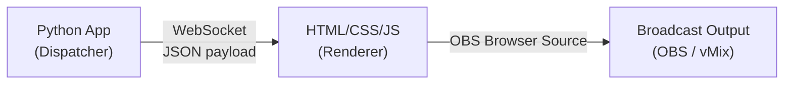

# Display and Broadcast

This document specifies how RhemaCast renders scripture text and delivers it to the broadcast software (OBS/vMix) for live display to the congregation.

---

## Architecture: The WebSocket/HTML Pivot

> [!IMPORTANT]
> **The Python application is NOT a pixel renderer.** An earlier design proposed rendering uncompressed 1920×1080 RGBA frames in Python and pushing them over NDI. This approach was abandoned because:
> 1. Continuously pushing uncompressed RGBA video frames through a Python NDI wrapper causes severe CPU bottlenecking.
> 2. Any Python-side rendering library (PyQt, OpenCV) would fight the STT model for GPU VRAM or saturate the CPU.
>
> The production architecture shifts all graphical compute to the broadcast software's built-in rendering engine.

### The Three Components



---

## Component 1: The Python Dispatcher

When the operator manually approves a verse, Python packages the display data into a minimal JSON payload and pushes it over a local WebSocket connection.

### WebSocket Server & State Reconciliation

During Phase 1 (Initialization), Python starts a lightweight WebSocket server on a local port. 

**The Last-Known-State Cache:** If OBS crashes and the Browser Source reconnects mid-service, the Python server only pushes payloads at the exact millisecond of a search trigger. A new connection would stare at a blank screen until the next verse. To prevent this, the server maintains a `current_display_state` variable. When a new client connects, the socket handler instantly pushes the current payload.

```python
import asyncio
import websockets
import json

connected_clients = set()
current_display_state = {"action": "clear"}

async def handler(websocket, path):
    connected_clients.add(websocket)
    try:
        # Instantly sync the newly connected OBS instance
        await websocket.send(json.dumps(current_display_state))
        async for message in websocket:
            pass  # Client doesn't send messages; this is one-way
    finally:
        connected_clients.discard(websocket)

async def start_server():
    server = await websockets.serve(handler, "localhost", 8765)
    await server.wait_closed()
```

### Display Payload Schema

The JSON payload pushed over the WebSocket is intentionally microscopic:

```json
{
  "action": "display",
  "ref": "John 3:16",
  "text": "For God so loved the world, that he gave his only begotten Son, that whosoever believeth in him should not perish, but have everlasting life.",
  "translation": "KJV",
  "theme": "default"
}
```

| Field | Type | Description |
|-------|------|-------------|
| `action` | string | `"display"` to show a verse, `"clear"` to remove the current display, `"update_theme"` to change visual styling |
| `ref` | string | Full scripture reference (Book Chapter:Verse) |
| `text` | string | The complete verse text in the active translation |
| `translation` | string | Translation abbreviation (e.g., "KJV", "NKJV", "NIV") |
| `theme` | string | Active visual theme ID (maps to a CSS class in the renderer) |

### Clear Payload

When the operator clears the screen or the display timer expires:

```json
{
  "action": "clear"
}
```

### Sending to All Clients

```python
async def broadcast_display(payload: dict):
    global current_display_state
    current_display_state = payload  # Update the cache
    
    message = json.dumps(payload)
    if connected_clients:
        await asyncio.gather(
            *[client.send(message) for client in connected_clients]
        )
```

### Operator Socket Telemetry Monitoring

The operator must know if the broadcast software is actively receiving the text before the service begins. 

The Operator UI continuously polls the `len(connected_clients)` value from the WebSocket server.
- If `length == 0`, a dedicated UI element displays a red tint/warning: **"OBS / DISPLAY NOT CONNECTED"**.
- If `length >= 1`, the element shifts to a green tint. This provides absolute visual confirmation prior to downbeat.


---

## Component 2: The HTML/CSS/JS Renderer

A static HTML file acts as the WebSocket client. It receives JSON payloads and updates the DOM to render the scripture text. All visual styling is handled natively by CSS.

### Base HTML Structure

```html
<!DOCTYPE html>
<html lang="en">
<head>
  <meta charset="UTF-8">
  <meta name="viewport" content="width=device-width, initial-scale=1.0">
  <title>RhemaCast — Scripture Display</title>
  <link rel="stylesheet" href="themes.css">
</head>
<body>
  <div id="scripture-container" class="hidden">
    <p id="verse-text"></p>
    <p id="verse-ref"></p>
    <p id="verse-translation"></p>
  </div>

  <script src="display.js"></script>
</body>
</html>
```

### JavaScript Client

```javascript
const WS_URL = 'ws://localhost:8765';
let socket;

function connect() {
  socket = new WebSocket(WS_URL);
  
  socket.onmessage = (event) => {
    const data = JSON.parse(event.data);
    
    switch (data.action) {
      case 'display':
        showVerse(data);
        break;
      case 'clear':
        clearDisplay();
        break;
      case 'update_theme':
        setTheme(data.theme);
        break;
    }
  };
  
  socket.onclose = () => {
    // Auto-reconnect after 2 seconds
    setTimeout(connect, 2000);
  };
}

function showVerse(data) {
  const container = document.getElementById('scripture-container');
  document.getElementById('verse-text').textContent = data.text;
  document.getElementById('verse-ref').textContent = data.ref;
  document.getElementById('verse-translation').textContent = data.translation;
  
  // Apply theme via CSS class swap
  container.className = `theme-${data.theme}`;
  
  // Animate in
  container.classList.add('visible');
  container.classList.remove('hidden');
}

function clearDisplay() {
  const container = document.getElementById('scripture-container');
  container.classList.add('hidden');
  container.classList.remove('visible');
}

function setTheme(themeId) {
  const container = document.getElementById('scripture-container');
  // Remove all theme-* classes, add the new one
  container.className = container.className.replace(/theme-\S+/g, '');
  container.classList.add(`theme-${themeId}`);
}

connect();
```

### Theme System (CSS)

Visual themes are implemented as CSS classes. Switching themes requires zero JavaScript DOM manipulation beyond a single class swap — fonts, kerning, colors, drop-shadows, and animations are all handled natively by the browser's CSS engine.

```css
/* Base styles */
#scripture-container {
  position: fixed;
  bottom: 10%;
  left: 50%;
  transform: translateX(-50%);
  text-align: center;
  max-width: 80%;
  transition: opacity 0.5s ease, transform 0.3s ease;
}

#scripture-container.hidden {
  opacity: 0;
  transform: translateX(-50%) translateY(20px);
  pointer-events: none;
}

#scripture-container.visible {
  opacity: 1;
  transform: translateX(-50%) translateY(0);
}

/* Theme: Default */
.theme-default #verse-text {
  font-family: 'Georgia', serif;
  font-size: 3rem;
  color: #ffffff;
  text-shadow: 2px 2px 8px rgba(0, 0, 0, 0.8);
  line-height: 1.4;
}

.theme-default #verse-ref {
  font-family: 'Arial', sans-serif;
  font-size: 1.5rem;
  color: #cccccc;
  margin-top: 0.5em;
}

/* Theme: Communion */
.theme-communion #verse-text {
  font-family: 'Palatino', serif;
  font-size: 2.8rem;
  color: #f5e6d3;
  text-shadow: 1px 1px 6px rgba(0, 0, 0, 0.6);
  letter-spacing: 0.02em;
}

/* Theme: Prophetic */
.theme-prophetic #verse-text {
  font-family: 'Cinzel', serif;
  font-size: 3.2rem;
  color: #ffd700;
  text-shadow: 0 0 20px rgba(255, 215, 0, 0.4);
  font-weight: bold;
}
```

> [!TIP]
> New themes are created by adding CSS classes — no code changes required. The system admin can add custom themes by editing `themes.css` and referencing the theme ID in the application settings.

### Theme Designer (Extension)

Not all operators know HTML and CSS. The **Theme Designer** is a drag-and-drop WYSIWYG interface — think Elementor — that allows non-technical users to visually compose broadcast themes without writing code.

| Property | Value |
|----------|-------|
| **Location** | Lives under the **Extensions** tab in the main application |
| **Output** | Generates CSS class definitions consumed by the Browser Source renderer |
| **Input model** | Drag-and-drop visual editor with live preview |
| **No-code guarantee** | Users position text elements, select fonts, adjust colors/shadows/animations, and export — zero manual CSS editing required |

**Why this works architecturally:** The WebSocket/HTML pivot means themes are pure code (HTML/CSS/JS) transmitted to the broadcast system's Chromium engine. The Theme Designer can therefore produce arbitrarily complex visual effects — gradients, particle overlays, animated lower thirds — because all rendering compute is offloaded to the remote system's GPU. The Python application never touches the pixels.

---

## Component 3: Display & Broadcast Routing

All graphical rendering is strictly offloaded from the Python execution environment. There is no NDI generation in Python, nor is there a custom Smart TV app.

### Option A: Broadcast Software (Primary)

The Python WebSocket dispatcher feeds an HTML/CSS interface into the Browser Source of an established broadcast software.

**OBS Studio Configuration**
1. **Add a Browser Source** to your scene.
2. **URL:** Point to the local HTML file (e.g., `file:///path/to/rhemacast/display.html`).
3. **Resolution:** 1920×1080.
4. **Custom CSS:** Leave empty — all styling is in `themes.css`.
5. **Transparency:** Default is transparent.

**vMix Configuration**
1. Add a **Web Browser Input**.
2. Point to the same URL and layer it above camera sources.

### Option B: Hardware Kiosk Mode (Direct TV Output)

For direct HDMI connection to a TV without OBS, the Main Thread launches an uncompromising Kiosk Browser to the secondary monitor coordinates.

> [!CAUTION]
> **VRAM Protection:** The execution strictly passes `--disable-gpu` and `--disable-software-rasterizer`, forcing the Chrome renderer onto standard RAM and CPU to protect the 4 GB GPU boundary for the Faster-Whisper model.

**Cross-platform kiosk launch:**

| OS | Browser | Executable Path | Kiosk Flag |
|----|---------|-----------------|------------|
| **Windows** | Chrome | `C:\Program Files\Google\Chrome\Application\chrome.exe` | `--kiosk --app=file:///path/to/display.html` |
| **Windows** | Edge | `msedge.exe` (system PATH) | `--kiosk --app=file:///path/to/display.html` |
| **Linux** | Chromium | `chromium-browser` or `chromium` | `--kiosk --app=file:///path/to/display.html` |

On both platforms, `--disable-gpu` and `--disable-software-rasterizer` are appended to protect VRAM.

### Video Backgrounds

> [!IMPORTANT]
> **Looping video backgrounds must be completely decoupled from the text rendering.** Do NOT attempt to decode video files within the Browser Source or the Python application.

The correct approach:

1. **Bottom layer (OBS):** A standard **Media Source** playing a looping MP4/WebM motion background.
2. **Top layer (OBS):** The transparent **Browser Source** displaying the scripture text via the WebSocket/HTML pipeline.

OBS composites these two layers using its internal, hardware-accelerated rendering engine. The Python application has zero awareness of or interaction with the video background.

> [!NOTE]
> **Platform Agnosticism:** The entire WebSocket/HTML display pipeline is fully platform-agnostic. The Python WebSocket server (`websockets`), the HTML/CSS/JS renderer, and the OBS Browser Source all function identically on Windows and Linux. No platform-specific code exists in this layer.

---

## Operator Version Interaction

The translation bar in the Manual panel (bottom-left of the Presentation tab) supports two distinct click interactions:

| Interaction | Behavior |
|-------------|----------|
| **Single-click** a translation | **Switch to and browse** that Bible version in the Manual panel. The browse view updates to show the current book/chapter in the clicked translation. No broadcast action is taken. |
| **Double-click** a translation | **Display the currently-selected verse** in the double-clicked translation on the broadcast output. This fires an immediate `display` WebSocket payload with the selected verse text in the target translation, regardless of whether a verse is currently visible on-screen. The operator can use the clear/show hotkey to toggle visibility separately. |

### Double-Click Display Payload

When the operator double-clicks a translation, the system constructs and broadcasts the display payload using the currently-selected verse:

```json
{
  "action": "display",
  "ref": "John 3:16",
  "text": "For God so loved the world that he gave his one and only Son, that whoever believes in him shall not perish but have eternal life.",
  "translation": "NIV",
  "theme": "default"
}
```

The `translation` field reflects the double-clicked version, and the `text` is pulled from the local Bible database for that specific verse-translation combination.

---

## Hotkeys & Operator Shortcuts

RhemaCast supports fully configurable hotkeys to accelerate operator workflow during a live service. Default bindings use **function keys** (F1–F12), which are rarely used by other applications.

### Hotkey Actions

| Action | Default Key | Behavior |
|--------|-------------|----------|
| **Display (Double-Click Equivalent)** | Configurable | Maps the double-click display action to a single key press. Displays the currently-selected verse on the broadcast output. |
| **Clear / Recall** | Configurable | **First press:** Clears the current display (sends `{"action": "clear"}`). **Second press (when already clear):** Recalls and re-displays the last cleared verse. |
| **Theme Cycle Forward** | Configurable | Cycles forward through the operator's ordered theme list. |
| **Theme Cycle Backward** | Configurable | Cycles backward through the operator's ordered theme list. |
| **Theme Reset** | Configurable | Instantly resets to the first theme in the list. |

The three-key theme cycling system allows the operator to memorize positional theme access — e.g., "the lower-third theme is five presses forward after a reset."

### Configuration

Hotkey bindings are loaded during **Phase 1 (Initialization)**. Default bindings are defined in `config.json`; operator-customized bindings persist in the SQLite `settings` table and override the defaults. See [database_and_storage.md](database_and_storage.md) for the configuration storage architecture.

### Key Interception

Function keys are intercepted at the application level to prevent them from triggering OS-level actions. The interception layer captures `keydown` events and suppresses default behavior for all mapped keys.

---

## Schedule Panel & Drag-and-Drop Workflow

The Schedule panel (left side of the Presentation tab) maintains an ordered list of verses queued for sequential display during the service. Verses are added via **drag-and-drop**, mirroring the EasyWorship workflow.

### Drag Sources

| Source | Drag Action |
|--------|-------------|
| **Bible Browser** (Manual panel) | Drag any verse from the browsing view to the Schedule panel |
| **Operator Review Queue** | Drag a queued search result to the Schedule panel |

### Drop Behavior

1. **Drop into the Schedule panel** — The verse is appended to the end of the schedule list.
2. **Drop between existing items** — The verse is inserted at the indicated position (a visual insertion indicator shows the drop target).
3. **Reordering** — Existing schedule items can be dragged within the panel to reorder them.

### Schedule Item Data

Each schedule item stores:

| Field | Description |
|-------|-------------|
| `ref` | Scripture reference (e.g., "John 3:16") |
| `translation` | The translation active at the time of the drag |
| `text` | The full verse text |
| `theme` | The active theme at the time of the drag (can be overridden per-item) |

---

## Display Routing Summary

| Source | Trigger | Flow |
|--------|---------|------|
| **Operator Approval** | Operator clicks "Show" on a queued or highly-ranked verse | UI Thread → `broadcast_display()` → WebSocket → HTML → OBS |
| **Manual Override** | Operator types ref and clicks "Show" | UI Thread → `broadcast_display()` → WebSocket → HTML → OBS |
| **Clear Screen** | Operator clicks "Clear" / timer expires | UI Thread → `broadcast_display({"action": "clear"})` → WebSocket → HTML → OBS |

> [!NOTE]
> **UI to Display Race Condition:** When the operator clicks "Show" on a queued verse, the execution is strictly decoupled. The **WebSocket Push** is fired asynchronously (`asyncio.create_task`) to update the screen instantly. Simultaneously, the **Database Log** is pushed to the unconstrained Database_Write_Queue. The WebSocket execution never awaits database write confirmation.

---

## Historical Note: The Original NDI RGBA Approach

The original architecture (documented in `questions.md` Q18) proposed having Python render scripture onto a transparent 1920×1080 canvas, convert it to raw RGBA byte arrays, and push uncompressed video frames through the NDI SDK (`ndi-python`). This was abandoned in `questions.md` Q23 due to:

- **CPU bottleneck:** Continuous 1920×1080 RGBA frame encoding in Python saturates the CPU.
- **VRAM contention:** Any GPU-accelerated UI renderer (PyQt with OpenGL, etc.) would compete with the STT model for the 4 GB VRAM budget.
- **Unnecessary complexity:** The broadcast software (OBS/vMix) already contains a highly optimized, hardware-accelerated Chromium engine (Browser Source) that performs this rendering for free.

The WebSocket/HTML pivot eliminates all three problems by shifting graphical compute entirely to the broadcast software.

---

## Cross-References

- **Search pipeline display decision:** [search_engine.md](search_engine.md)
- **Thread architecture and WebSocket server:** [architecture.md](architecture.md)
- **Operator controls:** [README.md](README.md)
- **Hotkey configuration storage:** [database_and_storage.md](database_and_storage.md)
- **Manual scripture navigation:** [search_engine.md](search_engine.md)
